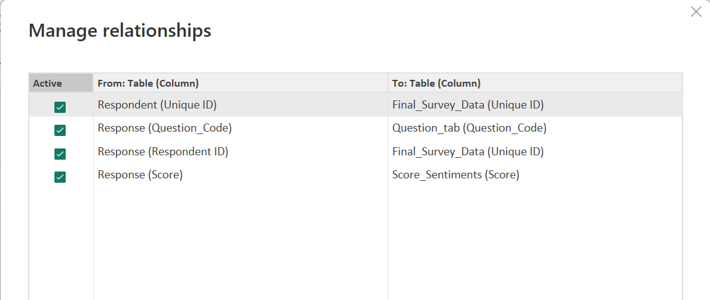
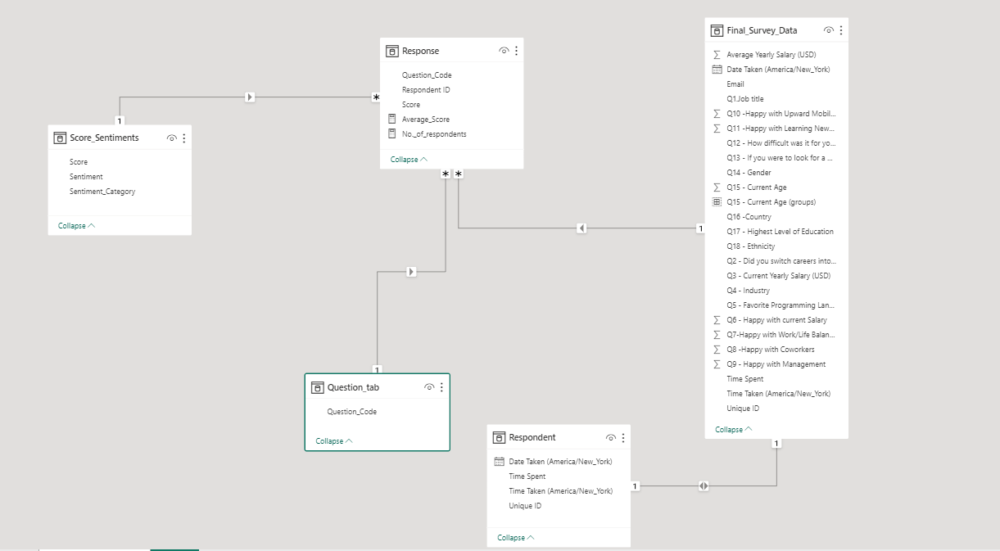
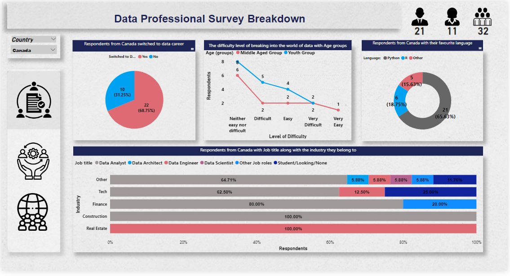
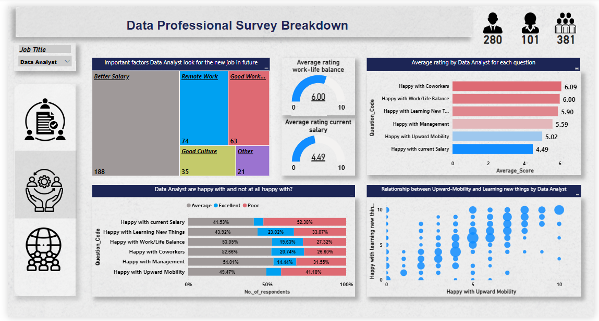
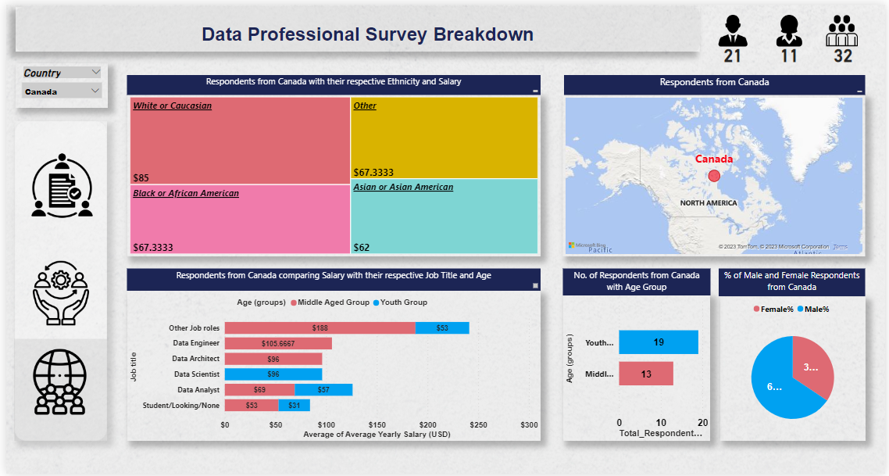

# Data-Professional-Survey-Breakdown--Power-Bi 

## Introduction
In this data analytics project, we will build a Data Professional Survey Breakdown in Power-BI.  

## Problem Statement
Segregated the data in Excel with different types of questions and made into 3 groups as pointed below:
1.	Basic analysis on respondents:
     - Switching to data career
     - Difficulty level of breaking to career of data
     - Most favourite programming language
     - Comparing the job title along with the industry

2.	Analysis on Work Culture based on the survey questions:
     - Important factors that respondents look for the new job
     - Average rating by the respondents for each survey question
     - Respondents are happy with and not at all happy with?
     - The relation between Upward-Mobility and learning new things

3.	Demographic Analysis:
    - Respondents with ethnicity and salary
    - Comparing salary with job title and age group
    - Number of respondents from country with age group
    - % of male and female respondents

## Mock-Up
Build a Mock up on dashboard in Power Point and shared as PDF file name 'Mock_Up.pdf'

## Skills/Concepts Demonstrated
The following Power BI features were incorporated: 
  - Dynamic title 
  - DAX functions 
  - Key Measures 
  - Page navigation 
  - Modelling

## Tables Created
Following are the **tables** used : 
1. Final_Survey_Data 
2. Score_Sentiments with (0-10) scores:  
   - 0-4: POOR 
   - 5-8: AVERAGE 
   - 9-10: EXCELLENT
3. Question_tab : 
   - Duplicated the “Final_Survey_Data” table and removed all the columns except the 6 Questions.
   - Unpivot the 6 Question columns (converts the question in columns to question in rows)
   - Delete the Value column and remove the duplicate values in Attribute column
   - Rename the Attribute column to Question_Code
4. Response table :
   - Duplicated the “Final_Survey_Data” table and removed all the columns except ‘Unique ID’, 6 Questions
   - Unpivot the 6 Question columns (converts the question in columns to question in rows)
   - Renamed the Unique ID column to Respondent ID ,Attribute column to Question_Code and Value column to Score.
5. Respondent table: Duplicated the “Final_Survey_Data” table and removed all the columns except: 
   - Unique ID
   - Date Taken
   - Time Taken
   - Time Spent

## Functions/Formula used
   ### Created table for the Key measures in Power Bi desktop and measures are as follows:
1.	Total_Respondents_Survey = COUNT(Final_Survey_Data[Unique ID])
2.	Total_M = CALCULATE(COUNT(Final_Survey_Data[Q14 - Gender]),Final_Survey_Data[Q14 - Gender]="Male")
3.	Total_F = CALCULATE(COUNT(Final_Survey_Data[Q14 - Gender]),Final_Survey_Data[Q14 - Gender] ="Female")
4.	Male% = DIVIDE([Total_M],[Total_Respondents_Survey])
5.	Female% = DIVIDE([Total_F],[Total_Respondents_Survey])
   ### Dynamic titles for graphs under Key Measures:
1.	Dynamic_Sub_Title_BA1 = IF( ISFILTERED(Final_Survey_Data[Q16 -Country]),"Respondents from " & SELECTEDVALUE(Final_Survey_Data[Q16 -Country]) & " switched to data career","Respondents from all countries switched to data career")
2.	Dynamic_Sub_Title_BA3 = IF( ISFILTERED(Final_Survey_Data[Q16 -Country]),
"Respondents from " & SELECTEDVALUE(Final_Survey_Data[Q16 -Country]) & " with their favourite language","Respondents from all countries with their favourite language") 
3.	Dynamic_Sub_Title_BA4 = IF( ISFILTERED(Final_Survey_Data[Q16 -Country]),"Respondents from " & SELECTEDVALUE(Final_Survey_Data[Q16 -Country]) & " with Job title along with the industry they belong to","Respondents from all countries with Job title along with the industry they belong to") 
4.	Dynamic_Sub_Title_WC1 = IF(ISFILTERED(Final_Survey_Data[Q1.Job title]),"Important factors " & SELECTEDVALUE(Final_Survey_Data[Q1.Job title]) & " look for the new job in future","Important factors Respondents look for the new job in future")
5.	Dynamic_Sub_Title_WC2 = IF( ISFILTERED(Final_Survey_Data[Q1.Job title]),"Average rating by " & SELECTEDVALUE(Final_Survey_Data[Q1.Job title]) & " for each question","Average rating from Respondents for each question")
6.	Dynamic_Sub_Title_WC3 = IF(ISFILTERED(Final_Survey_Data[Q1.Job title]),SELECTEDVALUE(Final_Survey_Data[Q1.Job title]) & " are happy with and not at all happy with?","Respondents are happy with and not at all happy with?")
7.	Dynamic_Sub_Title_WC4 = IF(ISFILTERED(Final_Survey_Data[Q1.Job title]),"Relationship between Upward-Mobility and Learning new things by "&SELECTEDVALUE(Final_Survey_Data[Q1.Job title]),"Relationship between Upward-Mobility and Learning new things by Respondents")
8.	Dynamic_Sub_Title_DA1 = IF(ISFILTERED(Final_Survey_Data[Q16 -Country]),"Respondents from "&SELECTEDVALUE(Final_Survey_Data[Q16 -Country])&"with their respective Ethnicity and Salary","Respondents with their respective Ethnicity and Salary")
9.	Dynamic_Sub_Title_DA2 = IF(ISFILTERED(Final_Survey_Data[Q16 -Country]), "Respondents from "&SELECTEDVALUE(Final_Survey_Data[Q16 -Country]), "Respondents")
10.	Dynamic_Sub_Title_DA3 = IF(ISFILTERED(Final_Survey_Data[Q16 -Country]), "Respondents from "&SELECTEDVALUE(Final_Survey_Data[Q16 -Country])& " comparing Salary with their respective Job Title and Age","Respondents comparing Salary with their respective Job Title and Age")
11.	Dynamic_Sub_Title_DA4 = IF(ISFILTERED(Final_Survey_Data[Q16 -Country]), "No. of Respondents from "&SELECTEDVALUE(Final_Survey_Data[Q16 -Country])& " with Age Group","No. of Respondents with Age Group")
   ### Converting age to Range(Group) of age under Final_Survey_Data:
1.	Data -> Final_Survey_Data ->Current Age -> … -> New Group -> Group type : List -> Under Ungrouped values select the values needed and click on Group icon were the selected values move under Groups and Members.
2.	Rename the grouped values. Here, we have grouped the age into 3 groups and are as follows:
    - 18-30 -> Youth Group
    - 31-55 -> Middle Aged Group
    - 56-100 -> Elder Group
  ### Created measures under Response table:
1.	Average_Score = AVERAGE(Response[Score]) # to get the average rating for each question
2.	No._of_respondents = COUNTROWS(Response) # since we have unpivoted the 6 columns with the respective scores the number of rows has been increased and to get the count we use this measure

## Data Modelling
Power BI automatically connected related tables resulting in a star schema model.Response table is a fact for the model and Score Sentiments,Question_tab,Final_Survey_Data and Respondent tables is dimension  for the model.
The relationship and the Data model are shown in the below screenshots:

Relationship                  |     Data-model
:---------------------------: | :-------------------------:
 |  

## Data Source
Downloaded the data in Excel from Alex the analyst learning YouTube channel. He took a survey from Data professionals which was posted on LinkedIn and Twitter with response of 700. 

## Data Transformation/Cleaning
   Connected the excel sheet in Power Bi and transformed the data which took to Power Query Editor	
1.	Removed the Unwanted columns from the table (Final_Survey_Data) from column ‘Browser’ to column ‘Reference’.
2.	In Q1. Column, since cleaning each and every ‘Other’ rows will take time. Also, as of now we do not want 1000 other options instead we can simplify it and make it to 6 or 7 options. For that, select Q1. Column -> Home->Split column -> By Delimiter (we have parenthesis after other). Under Select or enter delimiter->Custom-> ‘(’ -> Split at:’Left Most’, which will create another column and remove the extra column. Now we have few options instead of 100.
3.	Repeat the same steps for the Columns: Q4, Q5, Q8, Q11, Q13
4.	In Q3 Current Salary Column (eg:106k-125k), we will break up the numbers by taking average of the given range.
     - Duplicate the Column Q3, use the copy - We are going to split the column.Home->Split Column->Digit to Non digit
     - This helped to split the column into 3 columns.Replace ‘k’ with nothing,Replace ‘-’ with nothing and Replace ‘+’ with  225.
     - Convert the Data type of Q3. Copy1 and Q3.Copy2 to Whole No.
     - Now to calculate the Average for the column.Add column ->Custom Column -> New Column name: Average_Salary -> Formula : ([Q3.Copy1]+[Q3.Copy2])/2
     - Remove Q3.Copy1 and Q3.Copy2 columns

## Visualizations:
1.	Basic Analysis
2.	Analysis on Work- Culture
3.	Demographic analysis

## Analysis: 

## Basic Analysis 

  

### ‘Respondents from Canada switched to data career’ [Pie-chart]: 
Filtered by the country name Canada and can see the number of total respondents,male and female at the top right of the page.We can see that 68.7% of respondents from Canada were switched to Data career  i.e, initially these 68% were working on some other field. 

### ‘The difficulty level of breaking into the world of data with Age groups’ [Line chart]: 
The graph says that Only 1 middle aged person from Canada felt **Very Easy** to break in to world of data.None of the youngsters from Canada says that breaking into the world of  data is Very Easy but 4 youngsters do say that it was Easy.And 2 middle aged and 2 youth rates that the process of getting into the world of data is Very Difficult. 

### ‘Respondents from Canada with their favourite language’ [Donut Chart]: 
People from Canada rated **Python** as their favourite language with 65.63% ,R language with 18.75%. 

### ‘Respondents from Canada with Job title  along with the industry they belong to’ [100% stack bar chart]:
In Canada, we can see 80% of **data analyst** work for **Finance industry** whereas  100% of data analyst and data engineers works under Construction and Real estate industry respectively.  

## Work-Culture

  

### ‘Important factors Data Analyst look for the new job in future’ [Tree map]: 
The graph implies that 188 data analyst rate for **Better salary** in which 49 are Women. 74 data analyst wants to work anywhere grabs the second most important factor **Remote work** and 63 votes to have a **Good work-life balance**. 

### ‘Average rating by Data Analyst for each question’ [Stacked bar chart] : 
The bar chart shows 381 data analysts are happy to work with their **Co-Workers** with an average rate of 6.09 and score 6 is given as they are happy with their current **Work-Life balance**. But the reality is all the 381 data analysts are not happy with **Current Salary** in which 101 are women. 

### ‘Data analysts are happy with and not at all happy with?’[100% stack bar chart]: 
The chart says that 52% of Data analysts shows **Poor status** for their **current salary** and 23% of respondents are **very excited and love to learn new things**. 

### ‘Relationship between Upward-Mobility and Learning new things by Data Analyst’[Scatter chart] : 
Learning new things can promote upward mobility, and this is a way to nurture and elevate competitive advantage.
Here, we can see that there is a high chance of 15 data analysts getting promoted to upward mobility and this is because all 15 are excited and love to learn new things which leads to a happy upward mobility. 

## Demographic Analysis 

  

### ‘Respondents from Canada with their respective Ethnicity and Salary’[Tree map] :  
Among 32  Canadian respondents 7 **White or Caucasian** ethnic group bags the **highest salary with only one woman**. **Black or African American & Other** are the two ethnic groups with same salary of $67.3.And only 6 **Asian or Asian American ethnic women** are getting paid with $62 which is the least among all other ethnic groups in Canada. 

### ‘Respondents from Canada comparing Salary with their respective Job title and Age’[Stack bar chart] :  
The graph shows that the **Youngsters** from Canada are working with a low salary of $31 for the job titles **student/looking/none** implies those respondents may be working as an intern but there people get paid high with $96 for the role Data scientist at their young age.
In Canada, people with **Middle aged** group get paid high ($188) for **other job roles** and then comes **Data engineer** with $105. 

## My thoughts:
  - Even though the process of breaking into the world of data is difficult, most of the people are giving their efforts to get into it and also 372 out of 630 professionals have switched their initial career to the Data stream.This shows the demand for **Data analytics and Data Science is high**.
  - Learning **Python is highly demanded**, 66% of total respondents have voted their favourite language.
  - **Age no matters** in the world of data, because out of 630 responses 5 are elder people in which 3 female and 2 male different parts of the world. None of the elder group feel difficulty to get into Data world but the sad part is that they are paying high for ‘Other Job roles’.
  - Among 630 responses, 297 have voted to **get a better salary** were 66 women needs to improve their income.
  - Even though the respondents are ready and excited to learn new things they are **not happy with their current upward mobility**. This might affect the employees’ competitive advantage and performance too.

